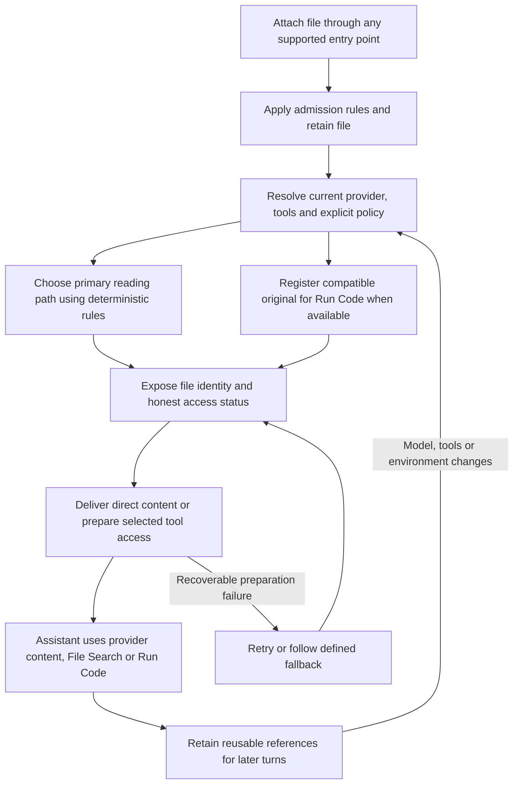

# Unified file uploads: problem statement and change requirements

**Status:** Development handoff proposal; application changes have not been implemented.

**Evidence reviewed:** October 4, 2026. Current-development source references are pinned to
commit [d0cbefd9d049d643b782d4b8a1c992346ce0d530][baseline]. GitHub issue states below are
a dated snapshot, not a claim about their future status.

**Audience:** LibreChat maintainers, backend and frontend developers, and QA.

## 1. Intended outcome

A nontechnical user should attach a file once and use it throughout the conversation without
choosing between provider upload, extracted text, File Search, and Run Code. LibreChat should
choose an initial reading path using deterministic rules and preserve access to the retained file
for other supported uses later.

The proposal has two independent decisions:

1. **Code access:** Whenever Run Code is available, every compatible, authorized attachment is
   available to that code environment, regardless of its primary reading path.
2. **Primary reading path:** File type, the current provider, existing effective limits, and the
   currently available LibreChat tools determine whether the file is read through the provider,
   extracted text, File Search, or Run Code.

Spreadsheets prefer Run Code whenever it is available. PDFs prefer native provider delivery when
the provider supports them and its existing validation and applicable request limits permit them.
Documents that cannot fit direct delivery prefer File Search, with defined fallbacks.

**There is no AI routing classifier, prompt-intent analysis, new generic tool-capability framework,
or new 20 MB routing threshold in this proposal.** Reuse the provider limits and validation already
in LibreChat. The assistant continues to decide what code to execute or what search to perform
through its ordinary tool use after the application has made file access available.

## 2. The user problem

### 2.1 The central concern is usability

The problem articulated in [Discussion #10941][discussion] is that users must remember which
upload mechanism belongs to which file or activity. They should not have to know that a workbook
belongs in a code environment, that a large document may benefit from retrieval, or that a provider
accepts one document format but not another.

A single attachment button solves only the entry-point problem. It does not solve this problem
if the automatic behavior chooses an unsuitable reading path or loses access when tools change.

The required user experience is:

> Attach the file, ask for the work, and let LibreChat make the file available through the
> appropriate existing tools. Reuse the same attachment when the requested work changes.

### 2.2 Representative failures

| Situation                                                 | Current or reported problem                                                                                                 | Required outcome                                                                                              |
| --------------------------------------------------------- | --------------------------------------------------------------------------------------------------------------------------- | ------------------------------------------------------------------------------------------------------------- |
| User attaches an Excel workbook with Run Code available   | Default unified routing extracts worksheet text into the prompt before code is considered as the preferred reader           | Keep workbook contents out of automatic prompt injection and make the retained workbook available to Run Code |
| Workbook contains a large compressed worksheet            | Unnecessary text extraction can fail before the workbook is usable by code                                                  | A code-preferred upload does not depend on successful text extraction                                         |
| User reads a PDF, then asks for a modified file           | The assistant may not know that the retained file is accessible to code, or an older upload path may lack a usable original | Native reading and later code access use the same retained attachment without another upload                  |
| Document exceeds direct provider limits                   | Rejection or filtering can occur before an alternative reader receives the file                                             | Preserve an otherwise-admitted file for File Search or Run Code                                               |
| User enables a tool after attaching a file                | The upload-time choice may no longer match the available tools                                                              | Reevaluate automatic delivery and prepare access from retained storage                                        |
| Conversation resumes or an agent uses another environment | Old paths, missing copies, or stale assumptions can make the file appear unavailable                                        | Reuse or recreate the correct authorized copy and advertise its actual access path                            |
| Several small documents are attached together             | Individually acceptable files can exceed aggregate request or context limits                                                | Apply existing aggregate limits and route eligible overflow without silent truncation                         |

Not every reported failure remains unfixed. The next section distinguishes open requests from
merged improvements that this work must reuse.

## 3. Public discussions and maintainer response

| Reference                                                                                          | Relevance                                                                                                                                                 | Verified response or status on October 4, 2026                                                                                                                                                                       |
| -------------------------------------------------------------------------------------------------- | --------------------------------------------------------------------------------------------------------------------------------------------------------- | -------------------------------------------------------------------------------------------------------------------------------------------------------------------------------------------------------------------- |
| [Discussion #10941: Unify the file upload process, planned?][discussion]                           | The primary product motivation: one upload flow, sensible defaults, less technical knowledge required; explicitly mentions Excel/CSV and Code Interpreter | Danny Avila [replied June 8, 2026][discussion-danny], linking the original unified-upload PR. This acknowledges the direction, not completion of automatic spreadsheet routing                                       |
| [March 5 comment in #10941][discussion-code]                                                       | Describes uploading once and making the same file available to conversation reading, File Search, and the code interpreter                                | Community proposal; do not attribute its specific suggestions to the maintainer                                                                                                                                      |
| [Issue #16618: Spreadsheet uploads are text-extracted despite Code Interpreter][issue-spreadsheet] | Closest reproduction: workbook text extraction despite code availability, plus files not announced before first code use                                  | Open, no public comments. Reported against v0.8.8. The first-call file-awareness portion overlaps a subsequent merged fix                                                                                            |
| [Issue #16560: Offer explicit destinations alongside unified upload][issue-choices]                | Requests an escape hatch because users cannot choose code/search when automatic extraction is unsuitable                                                  | Open, no public comments. This document pursues automatic defaults rather than requiring that choice in the normal flow                                                                                              |
| [Issue #16577: Provide file metadata when code is available][issue-metadata]                       | Reports models saying they do not have a file even though lazy provisioning can supply it                                                                 | Closed by Danny after the related fix. The reporter mentions a Discord discussion with Danny; that conversation was not independently reviewed                                                                       |
| [PR #16578: Advertise stable uploaded file paths before code execution][pr-paths]                  | Makes pending files discoverable before inference while preserving lazy copies                                                                            | Authored by Oliver777int; merged by Danny on October 2 at 01:31 UTC. Does not change spreadsheet routing defaults                                                                                                    |
| [PR #16058: Stop code outputs and tool-routed spreadsheets from locking threads][pr-lock]          | Fixes fallback text entering context before the first code copy and code outputs being counted incorrectly                                                | Authored and merged by Danny on September 18. The report describes approximately 700,000 spreadsheet characters entering context. Treat this as a regression already addressed, not an unresolved defect to recreate |
| [PR #15940: Opt-in text fallback for files no tool can read][pr-fallback]                          | Addresses files becoming unreadable after a handoff or tool/permission change                                                                             | Merged. Preserve the intent of optional fallback, without extracting every code-preferred workbook in anticipation of a hypothetical future fallback                                                                 |
| [Issue #15420: Unified Upload Phase 1 review follow-ups][issue-followups]                          | Maintainer-authored record of routing, provisioning, provider resolution, and cross-turn availability concerns                                            | Open tracker containing historical items, some already resolved. Its open state does not establish that each listed defect remains present                                                                           |

Danny's direct response in the primary discussion was:

> There’s an open PR for this I’m hoping to finalize this week

That was a June 8 statement about the original effort. It is not a current delivery commitment.
The evidence establishes maintainer awareness and ongoing fixes. It does not establish a public
commitment to the exact automatic defaults proposed here.

## 4. Current design and what should be retained

### 4.1 Present logical flow

1. An explicit destination takes precedence when the upload supplies one.
2. Otherwise, endpoint/global MIME configuration and system defaults infer a delivery path.
3. The system defaults favor provider delivery for images, PDFs, audio, and video, subject to
   provider support. Text-recoverable formats, including common spreadsheets, generally fall
   back to extracted text. Bedrock has additional native document handling.
4. Fresh unified uploads retain file bytes in storage. Text extraction can be stored alongside
   the file; it does not inherently replace the original workbook or PDF.
5. At turn initialization, the current provider and available tools are resolved. Inferred routes
   can be reevaluated; explicit destinations are preserved.
6. Compatible inferred attachments can be queued for code or search even when their primary
   delivery path is provider or text.
7. Later code advertises queued code paths before inference. Physical code copies and search
   indexing are performed when their tools need them.
8. Existing references, scope checks, retry handling, and session recovery support later turns.

The important limitation is that reevaluating a default text route generally produces another
text route. Enabling code does not currently turn the default spreadsheet rule into code-first
reading. Optional text fallback mostly concerns files already routed away from direct context.

### 4.2 Existing foundations, not new features to claim

Reuse the following wherever possible:

- Original-backed storage for fresh unified uploads.
- Existing provider encoders, effective file-limit resolution, and validators.
- MIME normalization and existing format allowlists.
- Current deployment, role, agent, and loaded-tool checks.
- Deferred code copying and vector indexing.
- Stable code filenames, collision handling, route-specific references, and session recovery.
- Current distinctions between inferred and explicitly chosen destinations.
- Authorization boundaries for conversation files, permanent agent files, and delegated files.
- Existing file previews, attachment controls, errors, and localized UI primitives.

The message-bar redesign can improve discovery, but its appearance is not evidence that the
backend reading policy has changed.

### 4.3 Version and evidence boundaries

Earlier investigation compared published v0.8.8 with a newer checkout at 1c0573130d. The October
file-path announcement and later session/history fixes were not in that published release.

For this handoff, current-development source references use [d0cbefd9][baseline], observed on
origin/dev on October 4. The workspace where this document was written was on the older dev
commit c7665ab1. Consequently, a newer file such as the queued-code-path module may be absent
from that local checkout even though it is present in the referenced development baseline.

Implement against the agreed current development base and verify its actual contents. This
document does not identify or make assumptions about the requesting organization's deployed image.

## 5. Scope and fixed design decisions

### 5.1 Included

- Automatic routing for ordinary unified conversation attachments.
- Consistent behavior for local selection, drag-and-drop, file paste, supported remote pickers,
  and reattachment of an existing original-backed file.
- Deterministic routing using file category, existing effective limits, provider support, and
  current LibreChat tools.
- Broad access to compatible originals through Run Code alongside their primary reading route.
- Defined fallback and failure behavior.
- Tool/model changes, later turns, restored conversations, and existing authorized handoffs.
- Clear user-visible preparation and limitation states.
- Compatibility controls, focused regression coverage, and real end-to-end acceptance.

### 5.2 Excluded

- An LLM classifier, prompt-intent classifier, or a separate AI planning call for routing.
- Per-operation distinctions such as choosing different upload paths for sheet names versus
  calculations versus workbook editing. They all use Run Code when available.
- A generic new registry for arbitrary MCP file capabilities.
- A new fixed byte threshold, a separate 20 MB preference, or a duplicate provider-limit table.
- Automatically granting permissions or overriding a deliberately disabled tool.
- Making every accepted media type code-compatible in this change.
- Redesigning permanent agent knowledge-base ownership or granting broader subagent sharing.
- Recovering original bytes that an old text-only record never retained.
- Unrelated changes to provider validation policy, parser safety limits, or model token pricing.

## 6. Terms and invariants

| Term                        | Meaning in this proposal                                                                                                                                                                                                                                                                                                      |
| --------------------------- | ----------------------------------------------------------------------------------------------------------------------------------------------------------------------------------------------------------------------------------------------------------------------------------------------------------------------------- |
| Retained original           | The stored attachment used for subsequent reading and copying. For workbooks and PDFs this must retain the uploaded file, not only extracted text. Existing intentional image resizing/conversion keeps its current semantics and correct effective MIME/filename; this proposal cannot restore bytes discarded before upload |
| Primary reading path        | The default way this turn's assistant receives or obtains the file: provider, extracted text, File Search, Run Code, or currently unavailable                                                                                                                                                                                 |
| Code availability           | The independent ability to supply a compatible retained file to the current authorized code environment                                                                                                                                                                                                                       |
| Available tool              | A tool permitted for the user and current agent/conversation, configured with the needed service, and actually exposed by the effective loaded tool set. A configured name or UI toggle alone is insufficient                                                                                                                 |
| Pending preparation         | The application has selected a usable path but copying, extraction, or indexing has not yet completed                                                                                                                                                                                                                         |
| Automatic attachment        | An attachment governed by inferred routing rather than an explicit legacy/user destination                                                                                                                                                                                                                                    |
| Direct-delivery eligibility | Support and validation for sending file content to the current provider/model, including applicable existing request and context limits                                                                                                                                                                                       |
| Admission                   | Whether the file may be accepted and retained at all under existing upload, permission, storage, and security rules                                                                                                                                                                                                           |

The implementation must preserve these invariants:

- **I-01:** Under the new default policy, a spreadsheet with usable Run Code and no explicit
  reading-route override is not automatically injected as full extracted text or a native workbook
  attachment. Code may return selected content through normal tool output later.
- **I-02:** Choosing provider, text, or File Search does not remove independent code access to an
  eligible retained original.
- **I-03:** A file selected for a tool is discoverable before the first inference and prepared
  before that tool relies on it.
- **I-04:** A provider-specific delivery rejection does not erase or silently filter an otherwise
  admitted file out of code/search access.
- **I-05:** Mere existence of cached extracted text is not permission to inject it into context.
- **I-06:** Changing a reading path does not change file identity, ownership, or authorized scope.
- **I-07:** No silent partial-text fallback is presented as full-file processing.
- **I-08:** Retained code copies do not themselves consume model-context tokens. File inventories,
  tool definitions/calls, and model-visible tool outputs do. Copying, storage, and execution still
  have infrastructure costs.

## 7. Required end-to-end flow

### 7.1 At attachment time

**F-01.** Use the existing admission rules and file-type normalization. Preserve stable file
identity and the retained attachment before a primary reader's optional processing can discard it.

**F-02.** Do not require a technical destination choice in automatic mode. Identical inputs and
effective configuration must produce equivalent behavior across supported entry points.

**F-03.** Do not eagerly extract an Excel workbook merely to establish that it exists or to prepare
a hypothetical future text fallback when Run Code will be the reader. This includes avoiding an
unnecessary workbook parser or OCR dependency on that path. Mandatory existing file-security
checks still apply; bypassing extraction is not permission to bypass admission or security policy.

**F-04.** Upload-time routing can be provisional when provider/tool state is unresolved. Defer
irreversible or expensive reader-specific work until the authoritative state is available. An
ordinary attachment may remain stored for a tool enabled later; permanent agent resources retain
their separate durable-resource requirements.

### 7.2 Before the first inference of a turn

**F-05.** Resolve the effective provider/model, configuration, permissions, and final loaded file
tools. Reuse existing role checks and tool-family recognition; do not substitute frontend claims
for server authority.

**F-06.** Determine the primary reading path and code availability independently. These are two
logical outcomes, not a requirement to introduce two particular database fields or a new wire API.

**F-07.** Give the assistant a compact inventory of relevant authorized files: identity, filename,
type, selected access method, and stable code path where applicable. Distinguish pending access
from successful reading. Do not populate this inventory with full spreadsheet contents.

**F-08.** A newly selected File Search attachment must be discoverable while indexing is pending.
Do not withhold it from search planning merely because it is not embedded yet, and do not inject
its complete extracted text just to make it visible. Index it before its search executes.

### 7.3 When a tool runs

**F-09.** Retain lazy preparation. Before the first applicable code call, supply compatible queued
files at the advertised paths in the selected environment. Before search, ensure the selected
search files are indexed in the correct namespace. Reuse successful preparations.

**F-10.** Do not require eager copying at attach time or eager indexing of every attachment. Broad
code availability does not imply that all uploads must also be embedded for File Search.

**F-11.** Preserve existing collision handling, cancellation, scoped references, partial-success
retention, and retry behavior. A tool must not continue as though required preparation succeeded
when a needed file failed to copy or index.

## 8. Deterministic reading rules

### 8.1 Precedence

Apply these in order:

1. Existing admission, authorization, and explicit administrative prohibitions.
2. Explicit user/legacy destination choices, preserving their established semantics.
3. Explicit endpoint/global routing configuration, preserving its documented precedence.
4. The new automatic defaults below when the automatic policy applies.

The table assumes no explicit route overrides. A configuration that deliberately forces text
remains an override; the automatic spreadsheet preference must not silently defeat it.

The existing value "none" means no direct model-content delivery. It does not, by itself, mean
Run Code was selected, File Search was selected, or a file is unusable. The implementation must
retain enough execution-time information to distinguish those outcomes.

### 8.2 Primary rule table

| Priority/category                                                                                            | Primary selection                                                                                                               | Fallback order                                                                                                                                                                                                                                        | Independent code access                                                                                        |
| ------------------------------------------------------------------------------------------------------------ | ------------------------------------------------------------------------------------------------------------------------------- | ----------------------------------------------------------------------------------------------------------------------------------------------------------------------------------------------------------------------------------------------------- | -------------------------------------------------------------------------------------------------------------- |
| Supported spreadsheets and tabular formats, including XLS/XLSX/ODS/CSV/TSV and supported columnar data       | Run Code whenever available                                                                                                     | For formats with a real reader: valid native provider delivery, then complete extracted text within existing limits, then compatible File Search. Otherwise unavailable. Never decode a binary format as text merely because other readers are absent | Yes whenever the format is code-supported and Run Code is available                                            |
| PDF that the current provider can accept under existing effective validation and request limits              | Provider                                                                                                                        | If native delivery is unsupported rather than too large, try supported extraction/OCR within text limits, then compatible File Search, then Run Code                                                                                                  | Yes                                                                                                            |
| PDF or document rejected for direct-delivery capacity, including applicable size/page/request/context limits | Compatible File Search                                                                                                          | Run Code, then complete extracted text only if that alternate representation genuinely fits existing limits. Otherwise unavailable                                                                                                                    | Yes                                                                                                            |
| Word and other document formats                                                                              | Valid native provider delivery where the actual provider/model accepts the format; otherwise supported extracted text that fits | Compatible File Search, then Run Code. For direct-capacity failures use the preceding row                                                                                                                                                             | Yes for code-supported formats                                                                                 |
| Plain text, Markdown, source code, and JSON                                                                  | Complete text in context when it fits                                                                                           | Compatible File Search, then Run Code. Otherwise unavailable                                                                                                                                                                                          | Yes for code-supported formats                                                                                 |
| Images                                                                                                       | Supported provider vision delivery                                                                                              | Existing OCR-to-text path when configured/supported and within limits. Otherwise no visual reading path; independent code access may still support file operations                                                                                    | Yes for code-supported image types                                                                             |
| Supported archives and opaque binary data without a native/text reader                                       | Run Code                                                                                                                        | Unavailable if Run Code is unavailable; no raw-byte text fallback                                                                                                                                                                                     | Yes                                                                                                            |
| Audio/video and formats outside the code-upload allowlist                                                    | Existing provider/transcription behavior                                                                                        | Existing supported fallbacks; report an unavailable reader when none applies                                                                                                                                                                          | Only if the current code-upload contract actually supports the format; do not broaden that contract implicitly |

Table interpretation:

- Test actual MIME/provider/service compatibility before taking any fallback.
- Columnar formats without a text reader stay tool-based even though they appear in the data
  category. JSON remains a text/source category by default; do not inspect the prompt to decide
  whether a particular JSON file is "data" or "configuration."
- Use the repository's existing accepted types and aliases. The examples do not authorize adding
  unsupported extensions or bypassing an explicit MIME allowlist.
- An image stored for code does not prove the selected model can see it. Likewise, File Search
  over extracted spreadsheet content is not equivalent to executable workbook analysis.
- Native format support means the actual encoder/provider combination can deliver that type.
  "This provider supports documents" does not imply every document format is supported.

### 8.3 Classification of unsuccessful paths

The fallback path must distinguish the reason a reader cannot be used:

| Reason                                             | Required behavior                                                                                                                                                                     |
| -------------------------------------------------- | ------------------------------------------------------------------------------------------------------------------------------------------------------------------------------------- |
| Unsupported provider format                        | Try the category's next supported reader                                                                                                                                              |
| Provider delivery capacity exceeded                | Prefer File Search, then Run Code, without reusing the failed capacity allowance for a direct retry                                                                                   |
| Extracted text exceeds existing limits             | Try compatible File Search, then Run Code; do not silently truncate and treat the route as complete                                                                                   |
| Mandatory admission/security rejection             | Reject according to the existing boundary contract; do not bypass the rejection through another tool                                                                                  |
| Reader-specific parser or indexing incompatibility | Keep an admitted original, try the supported fallback, and record a safe reason                                                                                                       |
| Temporary service/copy/index failure               | Use bounded existing retry behavior; preserve successful preparation and allow retry without reupload. Use another route only if it satisfies that route's own limits and permissions |
| Original missing/deleted or access revoked         | Report the actual limitation. Do not recreate from another user's copy or present stale access as working                                                                             |

An unsuccessful route must not cycle indefinitely through equivalent failures. Preserve the
failure reason for the current attempt and terminate with an actionable result when no route works.

## 9. Reuse existing limits; distinguish admission from delivery

### 9.1 No new provider threshold

**L-01.** Use the existing effective provider/model validators and configuration resolution as the
source of truth for native delivery. Do not add a 20 MB preference or copy their numeric defaults
into another routing module, UI, or configuration field.

**L-02.** Reuse applicable existing per-file, page, aggregate request, extracted-text, and context
limits. A file that fits individually may not fit alongside the other model-bound attachments.
Do not introduce a separate cumulative-budget subsystem as a prerequisite for this work.

**L-03.** The current validators commonly resolve an effective size with a configured limit when
present, otherwise a provider fallback. They do not universally take the minimum of both. Merged
endpoint configuration can also supply an inherited file-size default. Therefore nominal values
inside a validator are not necessarily the effective limits of a deployment.

Call the existing resolution/validation logic and test configured and unconfigured cases. Do not
silently change override precedence as part of routing. If a separate validation defect needs
correction, identify and review that change explicitly rather than hiding it in the new policy.

### 9.2 Admission must not make fallback unreachable

**L-04.** Distinguish an explicit limit on accepting a file at all from a provider-specific limit on
sending its content to a model. A hard server/admin upload limit remains binding for all routes.
A direct-provider capacity failure must leave an otherwise-admitted file eligible for code/search.

This distinction must hold at both upload-time and turn-time filtering. Today endpoint filtering
can remove files before provisioning, so adding a fallback after that filtering alone is insufficient.
Do not reinterpret an existing administrator-configured upload cap as merely a preference.

**L-05.** Existing aggregate admission rules apply to all uploads. Existing model-content limits
apply to attachments actually delivered as content. A code-only workbook's raw size or cached
extracted cells must not become model-content usage simply because the file is attached.

**L-06.** Resolve direct-content overflow deterministically. Preserve the application’s stable
attachment order and retain already admitted direct attachments where possible; evaluate additional
attachments against the remaining applicable allowance. Eligible overflow follows the capacity
fallback. Identical inputs and configuration must not select a different subset nondeterministically.

**L-07.** A current validator may require bytes or a bounded parse to establish eligibility. Reuse
results within the request. The proposal does not require full spreadsheet extraction to calculate
an unused text budget, nor an additional serial database read for each validation stage.

## 10. Code availability and file lifecycle

**C-01.** Apply broad code availability to every authorized, compatible original-backed automatic
attachment in the current conversation scope, including files whose primary path is provider,
extracted text, or File Search. Do not widen this to every file in the user's library or every file
owned by the agent.

**C-02.** Do not require another upload when the user switches from reading a PDF to modifying it,
or from viewing a file to executing code against it. This guarantee is conditional on the retained
file still existing and the user retaining access.

**C-03.** Advertised code filenames and paths must match the paths provided to execution, including
duplicate filenames, converted formats, and the actual selected execution environment. Reuse the
current destination planner and reference model; do not assume every environment uses one hardcoded
filesystem root.

**C-04.** Enabling Run Code after attachment or on a later turn must register compatible retained
files without reupload. Disabling it must remove code as an available reader for subsequent work
and reevaluate automatic reading paths. It does not retroactively remove content already sent in
an earlier model request.

**C-05.** A model/provider change must reevaluate native delivery against that provider's actual
format support and existing limits. Keep file identity and original storage independent of that
selection.

**C-06.** On restored conversations, expired sandbox copies, and execution-environment changes,
reuse valid references or lazily supply the retained original to the current environment. A
temporary liveness-check failure is not proof that the original file has been deleted.

**C-07.** Handoff agents use only the files existing authorization/sharing rules permit them to
receive, evaluated against their own provider and tools. File availability does not expand an
agent's scope or turn a conversation attachment into a shared permanent agent resource.

**C-08.** Preserve current generated-file identities and version/collision rules. Returning a
modified workbook or PDF must not accidentally overwrite the wrong original or make a later
reference select a different same-named file.

**C-09.** Run Code being enabled does not require a physical copy before the user sends a message.
Availability must be advertised first; required copying must complete before execution. A failed
background or lazy preparation must not invalidate a successful provider response that did not
depend on that preparation.

## 11. User experience requirements

**U-01.** The normal workflow remains one attachment action. No modal requires the user to choose
provider, context, File Search, or code. Legacy/expert controls can remain as compatibility features.

**U-02.** Use the same automatic routing for local selection, drag-and-drop, file paste, supported
remote pickers, and existing-file attachment. Preserve the deliberate text-paste behavior where
the application creates a text attachment from pasted prose.

**U-03.** Show meaningful preparation and failure states without exposing storage internals:
uploaded, preparing for search, preparing for analysis, ready, failed, canceled, and retrying where
they apply. A completed upload is not evidence the assistant has read the file.

**U-04.** When a limitation affects the user's work, describe it in ordinary language, for example
that spreadsheet analysis is unavailable or that the file can be searched but cannot currently be
opened for editing. Do not expose raw parser errors, credentials, provider payloads, or internal paths
as user-facing error explanations.

**U-05.** Do not ask users to reupload a retained, accessible file just to choose another reader.
Offer retry for temporary preparation failures. Requesting a replacement upload is appropriate
when the original is genuinely missing, invalid for every permitted route, or no longer accessible.

**U-06.** File Search availability is not a claim that every page has been read. The assistant's
answer should not claim exhaustive coverage from selected matches. This is an answer-quality
constraint, not an invitation to add task-intent classification to the upload router.

**U-07.** Keep localization, keyboard access, screen-reader announcements, and existing attachment
preview/download behavior intact. Use existing shared client primitives and semantic theme roles.

**U-08.** Use agent/preset defaults to expose Run Code and File Search for intended user groups so
normal users do not need per-upload tool activation. Routing must respect current authorization
and an explicit disable; this change does not silently alter permissions or saved-agent tool lists.

## 12. Configuration, persistence, and compatibility

**M-01.** Deliver the new automatic policy through a controlled rollout that preserves current
deployment behavior until selected. If a new policy selector is needed, define it in the existing
configuration schema with a compatibility-preserving default. The exact field name is an
implementation choice; it must not become a new file-size threshold or an environment-only switch.

**M-02.** Keep existing legacy-upload behavior and explicit routing controls functional. Preserve
the meaning and precedence of endpoint/global delivery overrides, the legacy UX setting, and
the explicit-destination marker. Do not change a deliberate user destination into broad automatic
sharing simply because another tool is now enabled.

**M-03.** The new defaults apply to inferred routes. Original-backed unified attachments may be
reevaluated on subsequent turns under the selected policy. Avoid rewriting every historical file
record merely to change an inferred default.

**M-04.** Preserve the intent of optional text fallback when no tool can read a file. In the new
policy, a code-preferred workbook must not require upfront extraction solely to prepare that
fallback. If the fallback becomes necessary later, derive bounded text from the retained original
then, or reuse suitable cached text. Respect existing fallback configuration and limits.

The existing textFallbackWithoutTools setting governs optional text fallback from a resolved
"none" route. It is not a universal prohibition on normal primary text delivery. The automatic
defaults may choose text directly when Run Code is unavailable and the table permits that reader.
However, an explicit configuration selecting "none" with text fallback disabled must remain free
of direct file-content delivery; the new defaults must not circumvent that choice by reclassification.

**M-05.** Historical text-only records may lack workbook/PDF bytes. They can retain their existing
text behavior but cannot meet the original-file editing guarantee. Surface that distinction honestly;
do not fabricate a binary file from a text extract and call it the original.

**M-06.** Treat older records without routing-choice metadata conservatively, preserving existing
legacy behavior. Do not infer a user's consent to another destination from missing fields.

**M-07.** Preserve compatibility for old clients and old stored/checkpointed runs. Mixed-version
rollout must not make new clients assume the server applied a policy it does not understand.
State how the policy is resolved for resumed runs; do not silently rewrite an in-flight request's
already encoded content.

**M-08.** Existing format conversions, file retention, deletion, storage strategy selection, and
tenant/user/agent scoping remain binding. The proposal adds no general retention exemption.

## 13. Development guidance and boundaries

This document specifies behavior, not a required class hierarchy or API schema. Keep the change
close to the existing routing and provisioning mechanisms.

- Shared deterministic routing/configuration contracts belong in **packages/data-provider**.
- Backend planning, extraction orchestration, validation integration, and preparation behavior
  belong in **packages/api**. Legacy **api** files should contain wiring rather than new behavior.
- Database-specific queries and persistence contracts belong in **packages/data-schemas**.
- Composer state and visible feedback belong in **client**, using existing shared primitives.
- Pass configuration, loaded user/agent data, database methods, and service clients into new code;
  do not create new global service lookups for routing.
- Reuse loaded request data and start independent reads in parallel. Avoid a new serial database
  query per file per phase or another whole-history scan for each reader.
- Keep storage copying streamed where the existing service supports it. Avoid buffering large
  originals merely to decide that they belong in code.
- Represent expected route rejection separately from an unexpected storage/network failure.
  Preserve existing external response contracts, safe error codes, and localized UI fallbacks.
- Provide safe diagnostic evidence of the effective reading route, code eligibility, preparation
  outcome, and fallback reason. Do not log file contents or treat provider exceptions as safe
  user-visible text. This need not create a new analytics subsystem.

### 13.1 Important implementation traps

1. Moving the spreadsheet branch after a text-extraction branch will preserve the current defect.
   Select the code preference before unnecessary extraction or prompt admission.
2. Adding a fallback after an upstream filter already discarded the file will not work.
   Follow admission, runtime filtering, routing, and provisioning together.
3. Checking only whether File Search is already embedded will hide a newly chosen lazy-search
   file. Pending search access needs the same discovery/preparation separation as pending code.
4. Allowing cached fallback text to override a new code/search reading decision recreates the
   large-context problem even if the new upload path looks correct.
5. Renaming or duplicating provider limit constants creates a second policy source and conflicts
   with the requirement to use existing effective validation.
6. Treating every configured MCP tool as a file consumer promises access the application cannot
   establish. Use the supported LibreChat file paths in scope.
7. Treating code availability as proof of successful copying creates misleading first responses.
   Advertise pending access accurately and gate the dependent operation on preparation.

## 14. Acceptance criteria

Each row is an observable requirement. Routing metadata alone is insufficient where the row
requires the file to reach a real consumer.

| ID   | Scenario                                                                                                             | Required evidence                                                                                                                                             |
| ---- | -------------------------------------------------------------------------------------------------------------------- | ------------------------------------------------------------------------------------------------------------------------------------------------------------- |
| A-01 | Fresh multi-sheet XLSX, automatic policy, Run Code available                                                         | Workbook retained; no eager text-extraction dependency; no full cells in initial model input; code can enumerate sheets and compute known totals              |
| A-02 | XLS/ODS/CSV/TSV MIME variants supported by the deployment                                                            | Normalization leads to the same code-preferred policy; valid fixture content reaches code                                                                     |
| A-03 | Large workbook that would fail the optional text parser's expansion limit                                            | If it passes applicable admission/security/code limits, code access succeeds without relying on that optional extraction; safety limits are not disabled      |
| A-04 | Model asks code to return selected workbook rows/text                                                                | Only model-visible tool output contributes those contents; raw stored bytes do not enter the prompt automatically                                             |
| A-05 | Small supported PDF, Run Code available, followed by a request to modify it                                          | Provider receives PDF; code opens the same retained PDF and returns a usable modified file; no second upload                                                  |
| A-06 | PDF exceeds effective native size or page limits but is admitted and search-compatible, with File Search available   | File survives routing/filtering; pending search access is advertised; indexing precedes search; no rejected native payload is sent                            |
| A-07 | Above-limit PDF with File Search unavailable and Run Code available                                                  | File goes to code access with a truthful status, without violating direct-delivery limits                                                                     |
| A-08 | Provider cannot natively accept a document type, but extraction is supported; compatible Run Code is available       | Complete extracted text is delivered only when within existing limits; original remains code-accessible                                                       |
| A-09 | Extracted document text exceeds the applicable limit                                                                 | Uses supported search/code fallback; no silent truncation presented as complete reading                                                                       |
| A-10 | Run Code unavailable for a spreadsheet                                                                               | Takes the documented supported fallback or reports the limitation; does not claim code execution or full editing capability                                   |
| A-11 | File Search service rejects a format its broad allowlist suggested was possible                                      | Original remains retained; failure is safely reported and the next supported route or retry is offered                                                        |
| A-12 | Several individually acceptable PDFs exceed an existing aggregate limit                                              | Stable attachment ordering yields a deterministic route allocation; no forbidden oversized provider request or silent disappearance                           |
| A-13 | File exceeds a hard administrator/server upload limit                                                                | Rejected as before; code/search does not bypass the upload restriction                                                                                        |
| A-14 | Configured and unconfigured provider limits, including model-specific handling                                       | New routing agrees with the existing effective validator and override resolution; no duplicate fixed cutoff                                                   |
| A-15 | Spreadsheet plus small PDF in one message                                                                            | Spreadsheet uses code; PDF uses provider where valid; both eligible originals remain accessible to code                                                       |
| A-16 | File uploaded before Run Code is enabled                                                                             | Enabling it later exposes the retained compatible file without reupload                                                                                       |
| A-17 | Run Code disabled after an earlier turn                                                                              | Subsequent automatic routing reevaluates; no claim that code remains usable; fallback text is obtained only if needed and permitted                           |
| A-18 | Model/provider changes after upload                                                                                  | File identity persists; new provider support/limits determine the new reading path                                                                            |
| A-19 | Reload, later turn, or expired sandbox copy                                                                          | Retained originals restore usable access in the current environment; no dependency on resending full file contents to the model                               |
| A-20 | Two different files with the same display name                                                                       | Stable identities and collision-safe code paths keep both distinguishable and readable                                                                        |
| A-21 | Partial code-copy failure, retry, and cancellation                                                                   | Successful copies are retained/reused; failed required preparation prevents dependent execution; cancellation does not claim readiness                        |
| A-22 | Indexing failure and later retry                                                                                     | No search is reported successful against a missing index; original and retry state remain usable                                                              |
| A-23 | Authorized handoff to another provider or code route                                                                 | Only permitted files are visible; receiving agent reevaluates routes and gets valid local preparation                                                         |
| A-24 | Explicit user/legacy destination choice                                                                              | Existing destination and sharing semantics win over automatic defaults; no silent migration or additional destination sharing                                 |
| A-25 | Old text-only record without original bytes                                                                          | Existing text behavior remains usable; limitations on original-file manipulation are accurately explained                                                     |
| A-26 | Picker, drag/drop, file paste, remote picker, and reattachment                                                       | Equivalent effective inputs produce equivalent automatic routing and errors                                                                                   |
| A-27 | Code-unsupported media/email/vector format accepted elsewhere                                                        | Existing supported media/text path remains intact; no incompatible code copy breaks unrelated work                                                            |
| A-28 | No compatible reader, original still retained                                                                        | User sees an actionable limitation; assistant does not claim to have read the file                                                                            |
| A-29 | New policy disabled or older client/server participating                                                             | Compatibility behavior remains correct; no assumptions about unsupported policy fields or destructive record changes                                          |
| A-30 | Permissions revoked or original deleted between preparation and use                                                  | Existing authorization/missing-file boundaries hold; no cross-user recovery or stale success claim                                                            |
| A-31 | Large document read through File Search                                                                              | Results identify their supporting passages; a partial retrieval is not described as an exhaustive review of every page                                        |
| A-32 | Inferred unified attachment with administrator text/provider/none reading override and compatible Run Code available | Reading override wins over automatic defaults; independent code access remains available. Explicit "none" with text fallback disabled does not inject content |

## 15. Verification and delivery plan

### 15.1 Verification layers

**Deterministic policy tests:** Exercise category precedence, actual tool availability, configuration
overrides, native validation results, fallback order, aggregate allocation, and pending preparation.
Use boundary fixtures immediately below/at/above existing effective limits rather than introducing
new threshold constants into tests.

**Backend integration tests:** Follow a retained file through admission, filtering, routing,
preparation, and actual model/tool payload construction. Cover pending search, lazy code paths,
scope, retries, cancellation, session expiry, and cached extracted text. Use real internal logic
and storage/database behavior where practical; mock only external boundaries.

**Frontend tests:** Verify consistent entry points, preparation and error states, retry, existing
file attachment, and accessibility. Assert observable behavior instead of merely mirroring route
implementation branches.

**End-to-end acceptance:** Include a real binary multi-sheet XLSX and a real PDF. Verify a workbook
calculation against known results, PDF provider reading followed by code editing, and a document
that exceeds native delivery limits but succeeds through File Search. Repeat relevant cases after
reload, tool changes, and a later turn. Inspect consumer payloads/receipts to prove where bytes and
text actually went, not only whether an upload chip appeared.

Existing unified E2E tests primarily use CSV/JSON/Markdown and fake code/search services. Earlier
focused testing passed 651 tests across 15 suites on the previously audited checkout; that is
historical evidence for existing behavior, not verification of this proposal or of the current
handoff baseline. A real binary XLSX-to-real-code workflow remains a required acceptance exercise.

### 15.2 Repository completion requirements for implementation

- Run focused Jest suites in the owning workspaces.
- Run TypeScript checks in every changed workspace; a build alone is not a typecheck.
- Run scoped import sorting and the applicable static checks.
- Run the repository's Lighthouse lane for implementation changes to file/message-loading paths.
- Complete the observable loading, failure, cancellation, retry, and restored-session behavior.
- Report the exact tested/pushed head, local checks, CI state, exact-head review result, and any
  real-service checks that could not be run.

This handoff document changes no application behavior and does not constitute those checks passing.

### 15.3 Suggested implementation sequence

1. Establish the shared automatic decision contract and tests, including explicit-policy precedence
   and reuse of current provider validation. Keep the public implementation small and typed.
2. Integrate code-first spreadsheet selection and preserve original-backed access before optional
   extraction. Address admission-versus-provider-delivery filtering together.
3. Connect primary reading decisions to provider/text delivery, pending File Search visibility,
   lazy preparation, and the existing code-path announcement mechanism.
4. Complete dynamic reevaluation, old-file compatibility, configuration rollout, and consistent
   frontend feedback across entry points.
5. Run the acceptance matrix on a configured pilot, including real services, before considering
   a maintainer-approved change to the default unified policy.

The development team owns module layout, exact configuration-field naming, final localized copy,
and test-fixture construction. Those choices must not reopen the fixed product decisions: no
technical routing decision for ordinary users, no AI classifier, no new provider-size threshold,
and compatible originals remaining accessible through code alongside their reading path.

## 16. Source map

These links are pinned to the current-development baseline used for the handoff. Symbol names are
more stable than line numbers; verify their locations when implementing on a newer commit.

| Area                                         | Source and relevant behavior                                                                                                                                                     |
| -------------------------------------------- | -------------------------------------------------------------------------------------------------------------------------------------------------------------------------------- |
| Current delivery defaults and consumers      | [resolve-llm-delivery-path.ts][source-routing]: system defaults; explicit tool resources; inferred turn routing; code/search compatibility and fallback                          |
| MIME support and configuration               | [file-config.ts][source-config]: supported format lists, normalization, existing limits, configuration merging                                                                   |
| Existing native validation                   | [files/validation.ts][source-validation]: provider/model-specific file validation, including PDF and Bedrock handling                                                            |
| Effective configured provider limit          | [files/encode/utils.ts][source-encode-utils]: getConfiguredFileSizeLimit and merged endpoint resolution                                                                          |
| Native document delivery                     | [files/encode/document.ts][source-document]: actual provider format handling and invocation of document validators                                                               |
| Upload endpoint/resource resolution          | [files/upload/routing.ts][source-upload-routing]: effective endpoint/provider/resource determination                                                                             |
| Retained original and text extraction        | [legacy Files/process.js][source-process]: createTextFile, retained upload storage, explicit-destination metadata; use as a call-site reference, not a location for new behavior |
| Optional fallback extraction                 | [files/upload/fallback.ts][source-fallback]: fallback eligibility, extraction and limits                                                                                         |
| Runtime file filtering                       | [files/filter.ts][source-filter]: endpoint/type/size filtering before downstream use                                                                                             |
| Model-bound attachment admission             | [agents/attachments.ts][source-attachments]: model-bound classification and attachment limits                                                                                    |
| Prompt text construction                     | [files/context.ts][source-context]: extracted-content delivery and existing truncation behavior to avoid using as silent automatic fallback                                      |
| Effective loaded tools and per-turn delivery | [agents/initialize.ts][source-initialize]: final tool availability, attachment routing and admission                                                                             |
| Historical files and provisioning queues     | [agents/resources.ts][source-resources]: explicit versus inferred destination handling, code/search queues, legacy text-only records and references                              |
| Code filenames and discovery                 | [files/code/queued.ts][source-queued] and [files/code/priming.ts][source-priming]: stable destinations and pre-inference path announcements                                      |
| Lazy preparation and retry                   | [files/provision/callback.ts][source-callback] and [files/provision/service.ts][source-service]: copying/indexing, correct scopes/environments, persistence and retry            |
| Client automatic versus legacy entry         | [useAttachItems.tsx][source-attach-items] and [useDragHelpers.ts][source-drag]: source/destination selection and entry-point routing                                             |
| Reusing an existing file                     | [useAttachExisting.ts][source-existing]: existing-file compatibility and attachment staging                                                                                      |
| Current unified E2E coverage                 | [unified-upload.spec.ts][source-e2e-unified] and [file-provisioning.spec.ts][source-e2e-provision]: existing routing and fake-service provisioning tests                         |

[baseline]: https://github.com/LibreChat-AI/LibreChat/commit/d0cbefd9d049d643b782d4b8a1c992346ce0d530
[discussion]: https://github.com/LibreChat-AI/LibreChat/discussions/10941
[discussion-danny]: https://github.com/LibreChat-AI/LibreChat/discussions/10941#discussioncomment-17219782
[discussion-code]: https://github.com/LibreChat-AI/LibreChat/discussions/10941#discussioncomment-16009094
[issue-spreadsheet]: https://github.com/LibreChat-AI/LibreChat/issues/16618
[issue-choices]: https://github.com/LibreChat-AI/LibreChat/issues/16560
[issue-metadata]: https://github.com/LibreChat-AI/LibreChat/issues/16577
[issue-followups]: https://github.com/LibreChat-AI/LibreChat/issues/15420
[pr-paths]: https://github.com/LibreChat-AI/LibreChat/pull/16578
[pr-lock]: https://github.com/LibreChat-AI/LibreChat/pull/16058
[pr-fallback]: https://github.com/LibreChat-AI/LibreChat/pull/15940
[source-routing]: https://github.com/LibreChat-AI/LibreChat/blob/d0cbefd9d049d643b782d4b8a1c992346ce0d530/packages/data-provider/src/resolve-llm-delivery-path.ts
[source-config]: https://github.com/LibreChat-AI/LibreChat/blob/d0cbefd9d049d643b782d4b8a1c992346ce0d530/packages/data-provider/src/file-config.ts
[source-validation]: https://github.com/LibreChat-AI/LibreChat/blob/d0cbefd9d049d643b782d4b8a1c992346ce0d530/packages/api/src/files/validation.ts
[source-encode-utils]: https://github.com/LibreChat-AI/LibreChat/blob/d0cbefd9d049d643b782d4b8a1c992346ce0d530/packages/api/src/files/encode/utils.ts
[source-document]: https://github.com/LibreChat-AI/LibreChat/blob/d0cbefd9d049d643b782d4b8a1c992346ce0d530/packages/api/src/files/encode/document.ts
[source-upload-routing]: https://github.com/LibreChat-AI/LibreChat/blob/d0cbefd9d049d643b782d4b8a1c992346ce0d530/packages/api/src/files/upload/routing.ts
[source-process]: https://github.com/LibreChat-AI/LibreChat/blob/d0cbefd9d049d643b782d4b8a1c992346ce0d530/api/server/services/Files/process.js
[source-fallback]: https://github.com/LibreChat-AI/LibreChat/blob/d0cbefd9d049d643b782d4b8a1c992346ce0d530/packages/api/src/files/upload/fallback.ts
[source-filter]: https://github.com/LibreChat-AI/LibreChat/blob/d0cbefd9d049d643b782d4b8a1c992346ce0d530/packages/api/src/files/filter.ts
[source-attachments]: https://github.com/LibreChat-AI/LibreChat/blob/d0cbefd9d049d643b782d4b8a1c992346ce0d530/packages/api/src/agents/attachments.ts
[source-context]: https://github.com/LibreChat-AI/LibreChat/blob/d0cbefd9d049d643b782d4b8a1c992346ce0d530/packages/api/src/files/context.ts
[source-initialize]: https://github.com/LibreChat-AI/LibreChat/blob/d0cbefd9d049d643b782d4b8a1c992346ce0d530/packages/api/src/agents/initialize.ts
[source-resources]: https://github.com/LibreChat-AI/LibreChat/blob/d0cbefd9d049d643b782d4b8a1c992346ce0d530/packages/api/src/agents/resources.ts
[source-queued]: https://github.com/LibreChat-AI/LibreChat/blob/d0cbefd9d049d643b782d4b8a1c992346ce0d530/packages/api/src/files/code/queued.ts
[source-priming]: https://github.com/LibreChat-AI/LibreChat/blob/d0cbefd9d049d643b782d4b8a1c992346ce0d530/packages/api/src/files/code/priming.ts
[source-callback]: https://github.com/LibreChat-AI/LibreChat/blob/d0cbefd9d049d643b782d4b8a1c992346ce0d530/packages/api/src/files/provision/callback.ts
[source-service]: https://github.com/LibreChat-AI/LibreChat/blob/d0cbefd9d049d643b782d4b8a1c992346ce0d530/packages/api/src/files/provision/service.ts
[source-attach-items]: https://github.com/LibreChat-AI/LibreChat/blob/d0cbefd9d049d643b782d4b8a1c992346ce0d530/client/src/hooks/Input/useAttachItems.tsx
[source-drag]: https://github.com/LibreChat-AI/LibreChat/blob/d0cbefd9d049d643b782d4b8a1c992346ce0d530/client/src/hooks/Files/useDragHelpers.ts
[source-existing]: https://github.com/LibreChat-AI/LibreChat/blob/d0cbefd9d049d643b782d4b8a1c992346ce0d530/client/src/hooks/Files/useAttachExisting.ts
[source-e2e-unified]: https://github.com/LibreChat-AI/LibreChat/blob/d0cbefd9d049d643b782d4b8a1c992346ce0d530/e2e/specs/mock/unified-upload.spec.ts
[source-e2e-provision]: https://github.com/LibreChat-AI/LibreChat/blob/d0cbefd9d049d643b782d4b8a1c992346ce0d530/e2e/specs/mock/file-provisioning.spec.ts
